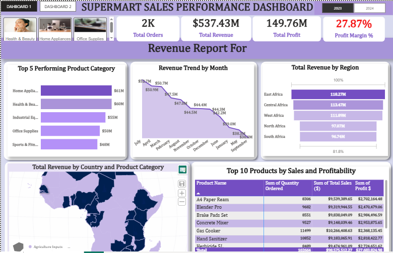
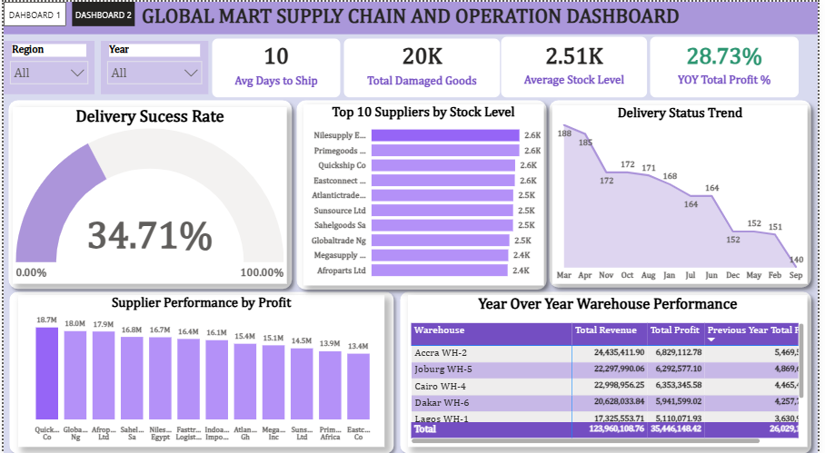

# 🛒 Global Mart Supply Chain & Sales Performance Dashboard

An end-to-end Power BI project analyzing sales performance and supply chain operations across Africa, built to help leadership monitor revenue, profitability, delivery reliability, and supplier performance from a single interactive report.

---

## 📑 Table of Contents

1. Project Overview
2. [Business Problem](#-business-problem)
3. [Project Objectives](#-project-objectives)
4. [Datasets](#-datasets)
5. [Dashboard Preview](#-dashboard-preview)
6. [KPIs](#-kpis)
7. [Business Questions & Insights](#-business-questions--insights)
8. [Business Insight](#-business-insight)
9. [Strategic Recommendations](#-strategic-recommendations)
10. [Future Improvements](#-future-improvements)

---

## 📌 Project Overview

This project is a two-page Power BI dashboard that gives a 360° view of a multi-country retail and supply chain operation:

- **Dashboard 1 — Sales Performance:** Tracks orders, revenue, profit, and profitability by product category, region, country, and individual products, with a year-over-year (2023 vs 2024) toggle.
- **Dashboard 2 — Supply Chain & Operations:** Tracks shipping speed, damaged goods, stock levels, supplier performance, delivery success rate, and warehouse-level year-over-year performance.

The report is filterable by **Region**, **Year**, and **Product Category**, allowing stakeholders to drill from a company-wide view down to a specific warehouse, supplier, or product.

## ❗ Business Problem

Retail and supply chain data for the business is generated across multiple systems (sales, warehousing, and supplier/logistics records), making it difficult for management to answer basic but critical questions quickly, such as:

- Which regions, categories, and products are driving revenue and profit — and which are underperforming?
- Are shipments arriving on time, and how reliable is the delivery process?
- Which suppliers and warehouses are the strongest and weakest performers?
- Is the business growing profit year-over-year, and where is that growth (or decline) concentrated?

Without a consolidated view, decisions on inventory, supplier contracts, and regional strategy were being made reactively and without a single source of truth.

## 🎯 Project Objectives

- Consolidate sales and supply chain data into one interactive Power BI report.
- Track core performance metrics (revenue, profit, profit margin, orders) at company, regional, and product-category level.
- Monitor operational health metrics (delivery success rate, average days to ship, damaged goods, stock levels).
- Benchmark supplier and warehouse performance to support sourcing and logistics decisions.
- Enable year-over-year comparisons to highlight growth trends and flag declining areas early.
- Deliver an intuitive, filterable interface that non-technical stakeholders can self-serve from.

## 🗂 Datasets

The report is built from retail sales and supply chain data covering operations across African regions (East, West, Central, North, and South Africa). Core data points include:

| Table / Entity | Key Fields |
|---|---|
| **Sales / Orders** | Order ID, Product Name, Category, Quantity Ordered, Total Sales, Profit, Country, Region, Date/Month, Year |
| **Suppliers** | Supplier Name, Stock Level, Profit Contribution, Country |
| **Warehouses** | Warehouse Name/Code, Total Revenue, Total Profit, Previous Year Total Profit |
| **Shipping / Delivery** | Days to Ship, Delivery Status, Damaged Goods, Delivery Success Rate |

## 🖼 Dashboard Preview

### Dashboard 1 — Supermart Sales Performance

### Dashboard 2 — Global Mart Supply Chain & Operations

## 📊 KPIs

**Sales Performance**
| KPI | Value |
|---|---|
| Total Orders | 2K |
| Total Revenue | $537.43M |
| Total Profit | $149.76M |
| Profit Margin % | 27.87% |

**Supply Chain & Operations**
| KPI | Value |
|---|---|
| Average Days to Ship | 10 |
| Total Damaged Goods | 20K |
| Average Stock Level | 2.51K |
| YoY Total Profit % | 28.73% |
| Delivery Success Rate | 34.71% |

## ❓ Business Questions & Insights

**1. Which product categories generate the most revenue?**
Home Appliances ($61M), Health & Beauty ($60M), and Industrial Equipment ($55M) are the top three categories, ahead of Office Supplies ($50M) and Sports & Fitness ($48M).

**2. Which regions contribute the most to total revenue?**
East Africa leads with $118.27M, followed closely by Central Africa ($113.47M) and West Africa ($111.09M). North Africa ($97.07M) and South Africa ($96.74M) trail behind, together contributing less than East and Central Africa combined.

**3. How has monthly revenue trended?**
Revenue peaked around July (~$53.7M) and has been on a general downward trend since, dropping to roughly $30M by September — signaling a seasonality or demand issue worth investigating.

**4. Which products drive the most sales and profit?**
Gas Cooker, Brake Pads Set, and Concrete Mixer are the top revenue generators, each bringing in over $9M in sales; A4 Paper Ream and Blender Pro also rank in the top 5 by profitability.

**5. Which suppliers hold the most stock, and which are most profitable?**
Nilesupply, Primegoods, and Quickship Co hold the highest stock levels (~2.6K units each), but **Quickship Co, Globaltrade Ng, and Afroparts Ltd** are the top performers by profit contribution (17M–18.7M each) — showing stock volume doesn't always align with profitability.

**6. How reliable is the delivery process?**
Delivery Success Rate sits at just **34.71%**, and the Delivery Status Trend shows a steady decline from 188 (March) to 140 (September) — a clear red flag for logistics performance.

**7. Which warehouses are the strongest performers year-over-year?**
Accra WH-2 and Cairo WH-4 lead in total revenue (~$24.4M and ~$23.0M respectively), with Accra WH-2 also posting the highest total profit (~$6.83M). All five tracked warehouses grew profit compared to the previous year.

## 💡 Business Insight

- **Growth is real but concentrated.** YoY total profit is up 28.73% and warehouse-level profit grew across the board, but growth is unevenly distributed — East, Central, and West Africa outperform North and South Africa by a wide margin.
- **Delivery performance is the biggest operational risk.** A 34.71% delivery success rate paired with a declining delivery status trend (188 → 140 over the observed period) suggests systemic issues in logistics, not a one-off disruption — this is likely eroding customer satisfaction and repeat orders.
- **Stock levels don't equal profitability.** The suppliers holding the most inventory (Nilesupply, Primegoods, Quickship Co) are not always the most profitable, indicating some capital may be tied up in slow-moving or lower-margin stock.
- **Revenue is decelerating monthly.** The steady month-over-month revenue decline since the mid-year peak needs root-cause investigation — whether seasonal, competitive, or supply-driven.

## 🧭 Strategic Recommendations

1. **Prioritize a delivery reliability audit.** Investigate root causes behind the 34.71% success rate and the downward delivery trend — carrier performance, warehouse dispatch times, or regional infrastructure gaps.
2. **Rebalance supplier contracts around profitability, not just stock volume.** Shift more purchasing toward high-profit suppliers (Quickship Co, Globaltrade Ng, Afroparts Ltd) and renegotiate or reduce reliance on low-margin, high-stock suppliers.
3. **Invest in underperforming regions.** North and South Africa lag well behind East, Central, and West Africa — targeted marketing, localized promotions, or expanded distribution could close the gap.
4. **Replicate top-warehouse practices.** Study what Accra WH-2 and Cairo WH-4 are doing well operationally and apply those practices to lower-performing warehouses like Lagos WH-1.
5. **Investigate the revenue decline post-July.** Run a seasonal/category-level breakdown to determine if the drop is demand-driven, stock-driven, or competitive, and plan promotions or replenishment ahead of the next expected dip.
6. **Reduce damaged goods.** With 20K total damaged goods reported, review packaging, handling, and warehouse storage conditions, especially at higher-volume warehouses.

## 🚀 Future Improvements

- Add **predictive analytics** (e.g., forecasted revenue and delivery success rate using Power BI's built-in forecasting or Python/R integration).
- Incorporate **customer-level data** (repeat purchase rate, customer satisfaction/NPS) to connect delivery performance to retention.
- Build **automated data refresh** via Power Query/Power BI Service scheduled refresh instead of manual updates.
- Add **drill-through pages** for individual suppliers, warehouses, and products for deeper root-cause analysis.
- Introduce **anomaly detection/alerts** (e.g., Power BI data alerts) for when delivery success rate or damaged goods cross a defined threshold.
- Expand geographic granularity beyond region/country to city or distribution-center level.
- Add a **cost/expense view** to complement revenue and profit, enabling full margin analysis.

---

*Built with Power BI ·, DAX measures, and conditional formatting used for KPI and warehouse performance cards.*
